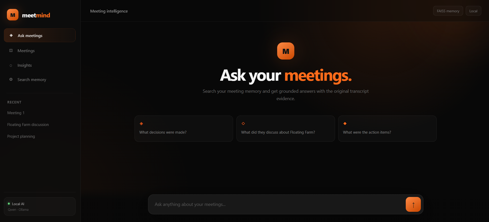
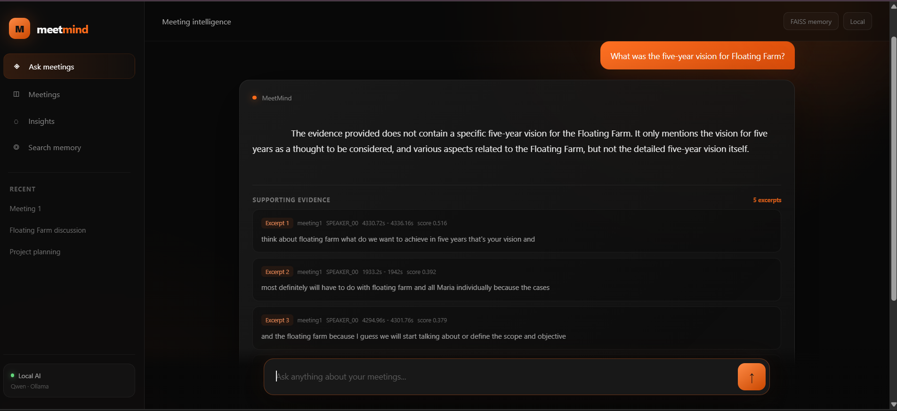

# MeetMind

### Multimodal Meeting Intelligence Platform

MeetMind is a local-first meeting intelligence platform that turns meeting recordings into searchable, structured, and grounded knowledge.

It combines speech transcription, speaker diarization, audio-visual speaker attribution, slide OCR, meeting-memory retrieval, and local LLM reasoning into one workflow.

The result is a system where you can ask questions about previous meetings and receive answers grounded in the original meeting evidence.

---

## Demo

### MeetMind — Meeting Intelligence UI



### Grounded Meeting Memory

Ask questions about previous meetings and MeetMind retrieves relevant transcript evidence before generating an answer.



---

## What MeetMind Does

MeetMind processes meeting recordings and builds a searchable memory of what was discussed.

The pipeline can:

- Transcribe meeting audio
- Identify and segment speakers
- Attribute speakers using audio and visual information
- Track faces across meeting frames
- Extract text from shared slides/screens using OCR
- Generate structured meeting information
- Store meeting chunks as searchable embeddings
- Retrieve relevant evidence from previous meetings
- Generate grounded answers using a local LLM
- Expose meeting memory through an MCP tool
- Allow Claude Desktop to query the meeting memory directly

---

## Architecture

```text
                    Meeting Recording
                           |
                           v
                +----------------------+
                | Audio / Video Input  |
                +----------+-----------+
                           |
             +-------------+-------------+
             |                           |
             v                           v
      Speech Processing            Visual Processing
             |                           |
             v                           v
       Transcription              Face Detection
             |                    + Face Tracking
             v                           |
      Speaker Diarization                |
             |                           |
             +-------------+-------------+
                           |
                           v
                Audio-Visual Fusion
                           |
                           v
                  Speaker Attribution
                           |
                           +------------------+
                           |                  |
                           v                  v
                     Slide / Screen        Transcript
                         OCR                  Chunks
                           |                  |
                           +--------+---------+
                                    |
                                    v
                           Meeting Knowledge
                                    |
                         +----------+----------+
                         |                     |
                         v                     v
                    FAISS Memory          Structured Data
                         |
                         v
                   Search / Retrieval
                         |
                         v
                  Grounded Evidence
                         |
                         v
                 Local LLM (Ollama)
                         |
                         v
                  MeetMind Answer

                  Key Features
1. Speech Transcription

Meeting audio is converted into timestamped transcript segments.

Technology:

faster-whisper

Transcript segments retain timing information so retrieved evidence can be traced back to the original recording.

2. Speaker Diarization

MeetMind separates the conversation into speaker segments.

Each transcript chunk can retain information such as:

Meeting: meeting1
Speaker: SPEAKER_00
Time: 4330.7s - 4336.2s
Text: think about floating farm what do we want to achieve in five years...

This allows retrieved answers to remain connected to the original meeting timeline.

3. Audio-Visual Speaker Attribution

MeetMind extends basic speaker diarization by combining voice information with visual information.

The pipeline includes:

Voice timelines
Face detection
Face tracking
Face-track clustering
Temporal co-occurrence
Speaker attribution

Audio and visual timelines are fused to improve identification of who was speaking during different parts of a meeting.

4. Slide and Screen OCR

Meetings often contain information that is displayed rather than spoken.

MeetMind can process shared-screen or slide frames and extract visible text using OCR.

Technology:

PaddleOCR

This allows meeting intelligence to incorporate information from presentations and shared screens.

5. Meeting Memory

MeetMind converts meeting chunks into embeddings and stores them in a FAISS vector index.

The process is:

Transcript
    |
    v
Meeting chunks
    |
    v
Embeddings
    |
    v
FAISS index
    |
    v
Semantic search

This creates a searchable memory of previous meetings.

For example:

Question:
"What did they discuss about Floating Farm?"

MeetMind retrieves the most relevant transcript excerpts from the meeting memory.

6. Grounded Answers

MeetMind uses retrieved meeting evidence as the basis for generating answers.

The workflow is:

User Question
      |
      v
Semantic Retrieval
      |
      v
Relevant Meeting Evidence
      |
      v
Local LLM
      |
      v
Grounded Answer

The UI also displays the supporting excerpts underneath the answer.

This makes it possible to inspect where an answer came from instead of relying on an unsupported response.

If the retrieved evidence does not contain enough information to answer a question, the system can state that the specific information was not present in the available evidence rather than inventing details.

7. Local AI

MeetMind uses Ollama for local LLM inference.

The current development setup uses:

Qwen 2.5 3B Instruct

This allows the meeting-question answering workflow to run locally.

Example:

Ollama
   |
   v
Qwen 2.5 3B Instruct
   |
   v
Grounded meeting response
8. MCP Meeting Search

MeetMind exposes its searchable meeting memory through the Model Context Protocol (MCP).

The MCP server provides:

search_meetings(question)

The tool searches the local meeting-memory index and returns relevant meeting evidence.

Example:

search_meetings(
    "What did they discuss about Floating Farm?"
)

The MCP server has been tested independently and successfully returns relevant transcript excerpts from the indexed meeting data.

Claude Desktop integration was explored during development, but it is not currently presented as a completed end-to-end feature.

Technology Stack
Component	Technology
Language	Python
Speech transcription	faster-whisper
Speaker diarization	pyannote.audio
Face analysis	DeepFace
OCR	PaddleOCR
Data validation	Pydantic
Vector search	FAISS
Local LLM runtime	Ollama
Local LLM	Qwen 2.5 3B Instruct
Tool protocol	MCP
Web UI	Streamlit
Speaker fusion	Audio + visual temporal fusion
Project Structure
meetmind/
│
├── app.py
│
├── memory.py
├── memory_search.py
│
├── mcp_server.py
├── mcp_test.py
│
├── fusion.py
├── final_fusion.py
├── active_speaker.py
│
├── eyes.py
├── ears.py
├── voices.py
│
├── pipeline.py
├── slides.py
│
├── ask_meeting.py
├── config.py
├── secretary.py
│
├── meetings/
│   └── meeting recordings
│
├── outputs/
│   └── generated meeting data
│
├── docs/
│   └── screenshots/
│       ├── meetmind-home.png
│       └── meetmind-grounded-answer.png
│
├── requirements.txt
├── .gitignore
└── README.md
Running MeetMind
1. Open the project

From PowerShell:

cd C:\Users\Harita\Downloads\meetmind\meetmind
2. Activate the virtual environment
.\venv\Scripts\Activate.ps1

You should see:

(venv)

at the beginning of your PowerShell prompt.

3. Install dependencies
pip install -r requirements.txt
4. Check Ollama

Make sure Ollama is installed:

ollama --version

Check available models:

ollama list

The current setup uses:

qwen2.5:3b-instruct
5. Start MeetMind

From the project directory:

python app.py

The application runs locally and provides the MeetMind meeting-intelligence interface.

Meeting Memory

The searchable meeting-memory workflow is based on semantic embeddings and FAISS.

Example:

from memory import smart_search


results = smart_search(
    "What did they discuss about Floating Farm?",
    5
)


print(results)

A result contains the original meeting chunk together with its retrieval score.

Example:

Meeting: meeting1
Speaker: SPEAKER_00
Time: 4330.72s - 4336.16s
Relevance: 0.516


think about floating farm what do we want to achieve
in five years that's your vision and
MCP Server

The local MCP server can be started with:

python mcp_server.py

The server exposes:

search_meetings

The tool searches the indexed meeting memory and returns relevant meeting evidence.

Example query:

What did they discuss about Floating Farm?

Example retrieved evidence:

Meeting: meeting1
Speaker: SPEAKER_00
Time: 4294.96s - 4301.76s


and the floating farm because I guess we will start
talking about or define the scope and objective
Example Workflow

A typical MeetMind query follows this process:

User:
"What did they discuss about Floating Farm?"
              |
              v
        FAISS Retrieval
              |
              v
      Relevant Transcript
              |
              v
       Local Qwen Model
              |
              v
       Grounded Answer
              |
              v
      Supporting Evidence

The user can inspect the retrieved excerpts directly in the UI.

Example Questions

MeetMind can be used for questions such as:

What did they discuss about Floating Farm?
What decisions were made?
What were the action items?
What was discussed about the project scope?
What did they want to achieve in five years?

The system retrieves relevant meeting evidence before generating the answer.

Example: Floating Farm

One of the indexed meetings contains discussion about a Floating Farm project.

A query such as:

What did they discuss about Floating Farm?

retrieves evidence including discussion about:

The Floating Farm itself
Maria's individual involvement
Defining the scope and objectives
What they want to achieve in five years
The project's vision
What the Floating Farm or CMAT means within a limited budget

The answer is accompanied by the original transcript excerpts used as evidence.

UI

The MeetMind interface is designed around a dark, glass-inspired visual system.

The interface uses:

Black and charcoal backgrounds
Orange accent colors
Glass-style cards
Minimal navigation
Meeting-memory indicators
Evidence cards
Grounded answer presentation

The primary interaction is:

Ask
 ↓
Retrieve
 ↓
Ground
 ↓
Answer
Local-First Design

MeetMind is designed around a local-first workflow.

The core meeting-processing and question-answering pipeline can run on the local machine.

This provides:

Local meeting processing
Local vector search
Local meeting memory
Local LLM inference
Greater control over meeting data
Reduced dependency on external AI APIs
Why MeetMind?

Meetings contain valuable information, but that information is often trapped inside long recordings and transcripts.

MeetMind turns that information into searchable memory.

Instead of:

Meeting recording
      ↓
Manually search transcript
      ↓
Find relevant section
      ↓
Read context

MeetMind enables:

Ask a question
      ↓
Retrieve relevant evidence
      ↓
Generate grounded answer
      ↓
Inspect supporting transcript
Current Status

Working local MVP

The current implementation includes:

Multimodal meeting processing
Speech transcription
Speaker diarization
Audio-visual speaker attribution
Face tracking
Slide/screen OCR
Meeting chunk generation
FAISS semantic search
Searchable meeting memory
Local Ollama inference
Qwen-based answer generation
Grounded answers
Supporting transcript evidence
MCP search_meetings tool
Dark glass-style MeetMind UI

The MCP server has been successfully tested independently against the meeting-memory index.

Claude Desktop integration was investigated during development but is not currently claimed as a completed feature.

Future Improvements

Potential future improvements include:

More robust cross-meeting retrieval
Better context expansion around retrieved transcript chunks
Improved speaker-name identification
Stronger multimodal speaker fusion
More advanced meeting summaries
Better action-item extraction
Improved OCR integration
More MCP client integrations
Improved retrieval ranking
Persistent meeting metadata and filtering
Project Goal

The goal of MeetMind is to turn meetings from passive recordings into an accessible, searchable knowledge base.

By combining multimodal meeting understanding, semantic retrieval, local AI, and evidence-based answers, MeetMind makes it possible to interact with past meetings as searchable knowledge rather than simply replaying recordings.